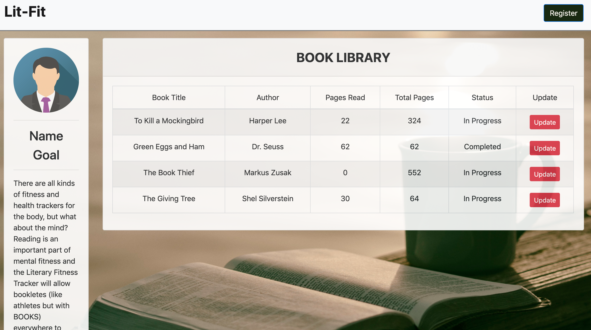
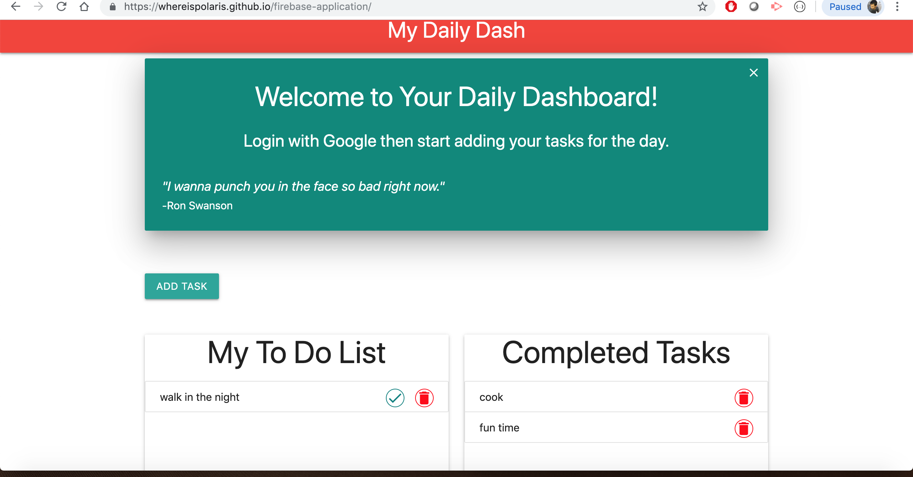
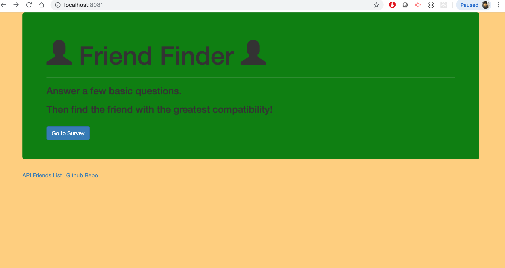
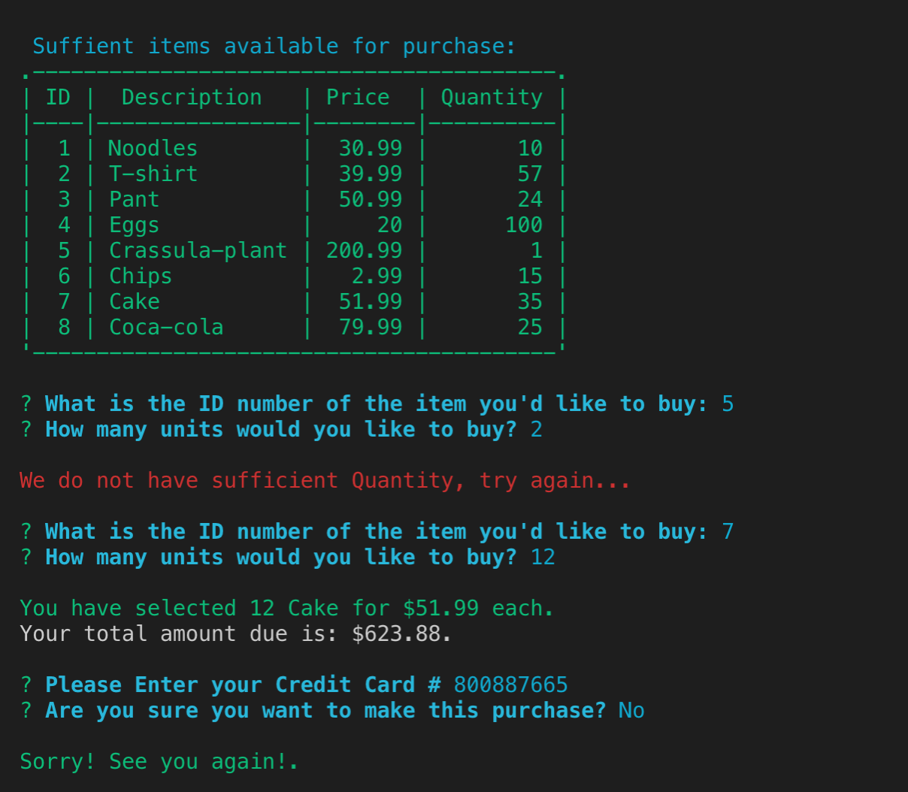
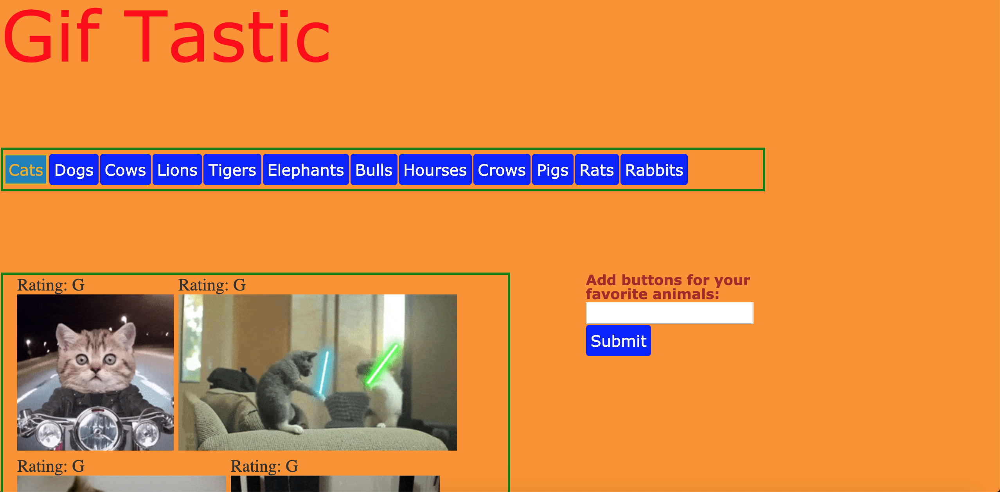

# final-portfolio:

# Literary FItness App
Project 2

1. The problem our app is trying to solve:
    - Our app aims to track the pages and books our user stores with us.

2. How is the app organized:
    - The app consists of a single index.html file that displays the UI
        - Various assets are joined with the index.html file to provide the user with an appealing display
            - CSS styling
            - Images
    - The app also consists of javascript files:
        1. index.js: this js facilitates the app's various functionalities.
        2. apiRoutes: this js handles the data we get, put, and post. 
        3. htmlRoutes: this js allows users to access the website and it's multiple pages (if we had more than one page).

3. How to run the app:
    1. Simply register a username and password, along with a book goal.
    2. Click the "Add Book" button to generate a row in the table.
    3. Input the book Title, Author, Pages Read, Total Pages, and Status of your book into their respective columns.
    4. Click Update to update the database with your book.
        - At any time, you may change the input fields to reflect your progress for any given book.
            - Hitting update will udpate the book progress to the database.

4. Image of code working:
    - 

5. Deployed version of the app:
    - [Heroku Deployed Version](https://project2-teas.herokuapp.com/#!)

6. My app utilized the following:
    - Express
    - Sequelize
    - MySql 
    - Github
    - Heroku
    - Jquery
    - Animate.css Library

7. My group and I developed this app for our second project of the UT Coding Bootcamp.

# My Daily Dash

1.	Project 1: My Daily Dash
This was our first group project where were created an app for user's daily activities. 
The purpose of this project was to give user an app for their routine management so that 
they can accomplish their daily goal on time. 

 
Another interesting fact about the project was to give user rewards points if they achieve their goal on time. 
# See The Demo:
 
 https://whereispolaris.github.io/firebase-application/

  
  
We used firebase database and google authentication for user's data management. Managing data on firebase and providing log in information to user's identity were the most challenging parts of this project. 
However, several hours of rigorous of work team members achieved these goals and we feel very proud of our teamwork.
 
 

# Some of the other Assignments that I worked with:
# Friend-Finder
# Express.js homework

## SEE THE DEMO 

## View Sharable link below!!
https://drive.google.com/open?id=1zHd3PDzU3L0fmrXyWgsqkyH8Et4zL8lo

## Description

Friend Finder is a compatibility based dating app. This is a full-stack site where users completes a survery, then their answers are compared with those from other users. The app then displays the best match of user's input to those of overall match with name and picture of a best friend. Please check the DEMO video link provided above to best familiarize yourself with this app.

## How This App work?
This App was made working with the help of following dependencies:
* body-parser
* express
* path

## What will user Do?

* The user will first visit the home page. The home page will tell them to take the survey.
* The user will be directed to survey page whem they click on the survey button.
* The survey page will tell the user to input his/her name and provide a link to his/her      picture.
* The user will then complete the survey questions that follows based on their degree of stisfaction.
* The App will then display the best match of user with the name and picture of their best friend.

## Developer's perspectives:
1. server.js file requires npm packages listed abobe which has been installed successfully.
2. There are two main routes in this application:
* htmlRoutes which includes a get route to survey page.
* apiRoutes which contain a get route to api/friends containing JSON of all possible friends.
* It also contains a POST routes to api/friends which handle incoming survey results. This route is also routed to logis.js file which handles the compability logic.
* Application's data are saved inside of a friends.js file as an array of objects.
* The logic.js handles the compability of friens and display the result as a modal pop-up.
2.	Train Scheduler: This was another interesting project that I worked on to display the time schedule of any train system. 

 
I utilized JavaScript, jQuery and Moment.js to achieve this goal. 
Working with moment.js was another interesting fact that I learned during this project. 
Most Challenging part of this project was to set up time updates of the train schedule which i achieved with moment.js. 
 

## Bamazon

# Banaon Customer App
# bamazon

## SEE THE DEMO 

## View Sharable link below!!

https://drive.google.com/file/d/1ywZBqj9r0Xq3aACf4l2ThgrP_ih_W-Ge/view

## Dependencies used in this bamazone App:
    * ascii-table
    * chalk
    * colors
    * inquirer
    * mysql

    In this activity, i created  a Amazon-like storefront using  the MySQL. The app will take in orders 
    from customers and deplete stock from the store's inventory.

## Description

This application implements a simple command line based storefront using the npm [inquirer]package and the MySQL database package. The application presents interface for: **customer** 

## Getting Started 
1. Clone the repository. 
2. Run command `npm install` in Terminal.
3. Set up MySQL database.

### What JavaScript does!!

1. `bamazonCustomer.js`

    * Prints the products in the store.
    * Prompts customer which product they would like to purchase by ID number.
    * Asks for the quantity.
    * Type in the ID number of the item you'd like to buy: 
    * How many units would you like to buy? 
    * Please Enter your Credit Card # 
    * Are you sure you want to make this purchase? y/n

      * If there is a sufficient amount of the product in stock, it will return the total for that purchase.
      * However, if there is not enough of the product in stock, it will tell the user that there isn't enough of the product.
      * If the purchase goes through, it updates the stock quantity to reflect the purchase.
      * It will also update the product sales in the department table.

	# Gif Tastic: 
  
   
   
  This was my best project and i feel so proud that I achieved this goal. 
Although, it was a bit challenging, i am happy to show that hard work let us accomplish our goal. 
Getting the Json data and implementing it with my project with associated key were very difficult to achieve. 
However, the knowledge that I gained during my course work at UT Austin coding Bootcamp help to attain those goal. 

